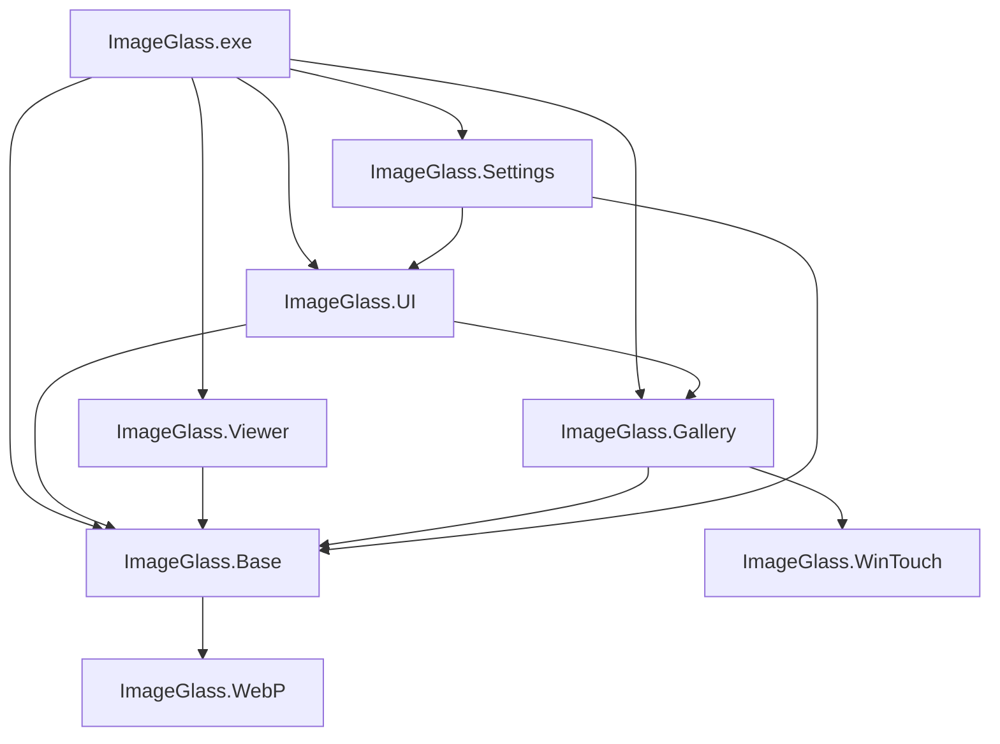

## Overview

ImageGlass is built using a modular architecture with multiple components that work together to provide a fast and lightweight image viewing experience. The application is built on .NET 10 and uses Windows Forms for the UI framework.

## Component Architecture

ImageGlass is organized into the following main components:



## Core Components

### ImageGlass (Main Application)

**Location**: `Source/ImageGlass/`

**Purpose**: The main executable and entry point for the application.

**Key Responsibilities**:
- Application initialization and lifecycle management
- Main window (FrmMain) and UI orchestration
- Event handling and user interactions
- Integration of all components

**Key Files**:
- `FrmMain/` - Main window implementation
- `ImageGlass.csproj` - Project configuration
- `app.manifest` - Application manifest for Windows

**Dependencies**:
```xml
<PackageReference Include="D2Phap.FileWatcherEx" Version="3.0.0" />
<PackageReference Include="ImageGlass.Tools" Version="1.9200.2" />
```

### ImageGlass.Base

**Location**: `Source/Components/ImageGlass.Base/`

**Purpose**: Core functionality and utilities used across all components.

**Directory Structure**:
```
ImageGlass.Base/
├── Actions/          # Action system (SingleAction, ToggleAction)
├── BHelper/          # Helper utilities and extensions
│   └── Extensions/   # Extension methods for common types
├── Cache/            # Caching mechanisms
├── Colors/           # Color management utilities
├── EditApps/         # External editor integration
├── FileSystem/       # File system operations
├── ImageInfo/        # Image metadata handling
├── InstanceManagement/ # Single-instance application management
├── Language/         # Localization support
├── Photoing/         # Image processing utilities
├── QueuedWorker/     # Background task management
├── Types/            # Common types and enums
├── Update/           # Update checking and management
├── Webview2/         # WebView2 integration
└── WinApi/           # Windows API interop
```

**Key Classes**:
- `App.cs` - Application-level utilities and constants
- `BHelper/Extensions/` - Extension methods for Bitmap, Color, Control, etc.
- `Types/Const.cs` - Application constants
- `Types/Enums.cs` - Common enumerations

**Example - Extension Methods**:

```csharp Source/Components/ImageGlass.Base/BHelper/Extensions/BitmapExtensions.cs
public static class BitmapExtensions
{
    /// <summary>
    /// Gets pixel color.
    /// </summary>
    public static Color GetPixelColor(this Bitmap? bmp, int x, int y)
    {
        if (bmp == null) return Color.Transparent;

        unsafe
        {
            var bitmapData = bmp.LockBits(
                new Rectangle(0, 0, bmp.Width, bmp.Height), 
                ImageLockMode.ReadOnly, 
                bmp.PixelFormat);

            var firstPixelPtr = (byte*)bitmapData.Scan0;
            var position = (bitmapData.Stride * y) + (x * 4);

            var color = Color.FromArgb(
                firstPixelPtr[position + 3],
                firstPixelPtr[position + 2],
                firstPixelPtr[position + 1],
                firstPixelPtr[position + 0]);

            bmp.UnlockBits(bitmapData);
            return color;
        }
    }
}
```

**Major Dependencies**:
- Magick.NET (ImageMagick for .NET) - Image processing
- Microsoft.Web.WebView2 - Embedded browser control
- PhotoSauce.MagicScaler - High-performance image scaling
- DirectNStandard - Direct2D and DirectX interop
- WicNet - Windows Imaging Component
- Microsoft.Windows.CsWin32 - Windows API source generation

### ImageGlass.UI

**Location**: `Source/Components/ImageGlass.UI/`

**Purpose**: Custom UI controls and components.

**Key Features**:
- Modern UI controls with custom styling
- Theme support and visual customization
- Reusable UI components

**Key Components**:
- Custom labels and buttons
- Modern link labels
- Toolbar components
- Dialog and form bases

**Dependencies**:
```xml
<ProjectReference Include="ImageGlass.Base" />
<ProjectReference Include="ImageGlass.Gallery" />
<PackageReference Include="Microsoft.Windows.CsWin32" />
```

### ImageGlass.Viewer

**Location**: `Source/Components/ImageGlass.Views/`

**Purpose**: The core image viewing canvas with rendering capabilities.

**Key Files**:
- `ViewerCanvas.cs` - Main image viewer control
- `ViewerCanvas_Touch.cs` - Touch input handling
- `ViewerCanvas_Webview2.cs` - WebView2 integration for web content
- `SelectionResizer.cs` - Image selection and cropping
- `VHelper.cs` - Viewer helper utilities

**Features**:
- Hardware-accelerated rendering
- Zoom and pan functionality
- Touch and gesture support
- Selection and cropping tools
- WebView2 integration for SVG, HTML, and other web formats

**Dependencies**:
```xml
<ProjectReference Include="ImageGlass.Base" />
<ProjectReference Include="ImageGlass.WinTouch" />
```

### ImageGlass.Gallery

**Location**: `Source/Components/ImageGlass.Gallery/`

**Purpose**: Thumbnail gallery and image list management.

**Directory Structure**:
```
ImageGlass.Gallery/
├── Cache/            # Thumbnail caching
├── Extractor/        # Thumbnail extraction
├── Item/             # Gallery item models
├── Managers/         # Gallery management
└── Renderer/         # Thumbnail rendering
```

**Key Features**:
- Efficient thumbnail generation and caching
- Virtual scrolling for large image collections
- Background thumbnail loading
- Memory-efficient rendering

**Dependencies**:
```xml
<ProjectReference Include="ImageGlass.Base" />
<ProjectReference Include="ImageGlass.WinTouch" />
```

### ImageGlass.Settings

**Location**: `Source/Components/ImageGlass.Settings/`

**Purpose**: Application settings and configuration management.

**Directory Structure**:
```
ImageGlass.Settings/
├── Events/           # Settings-related events
├── Forms/            # Settings UI forms
├── ToolConfigs/      # Tool configuration models
└── WebUI/            # Web-based settings UI (excluded from build)
```

**Key Features**:
- JSON-based configuration storage
- Settings validation and migration
- Settings dialog forms
- Tool and external app configuration

**Dependencies**:
```xml
<PackageReference Include="Microsoft.Extensions.Configuration" />
<PackageReference Include="Microsoft.Extensions.Configuration.Json" />
<ProjectReference Include="ImageGlass.Base" />
<ProjectReference Include="ImageGlass.UI" />
```

### ImageGlass.WebP

**Location**: `Source/Components/ImageGlass.WebP/`

**Purpose**: Native WebP image format support.

**Key Features**:
- WebP decoding and encoding
- Integration with libwebp
- Optimized performance for WebP images

**Dependencies**:
```xml
<ProjectReference Include="ImageGlass.WebP" />
```

### ImageGlass.WinTouch

**Location**: `Source/Components/ImageGlass.WinTouch/`

**Purpose**: Windows touch and gesture input handling.

**Key Features**:
- Multi-touch gesture recognition
- Touch-optimized interactions
- Windows Ink support

### igcmd (Command-Line Utility)

**Location**: `Source/igcmd/`

**Purpose**: Command-line interface for ImageGlass operations.

**Key Features**:
- Batch image operations
- Automation and scripting support
- Integration with shell scripts

**Dependencies**:
```xml
<PackageReference Include="ImageGlass.Tools" Version="1.9200.2" />
<ProjectReference Include="ImageGlass.Base" />
<ProjectReference Include="ImageGlass.Settings" />
<ProjectReference Include="ImageGlass.UI" />
<ProjectReference Include="ImageGlass.Viewer" />
```

## Data Flow

### Image Loading Pipeline

1. **File System** (ImageGlass.Base) - Detects and lists image files
2. **Image Loading** (ImageGlass.Base) - Loads image data using appropriate codec
3. **Processing** (ImageGlass.Base) - Applies transformations, color management
4. **Rendering** (ImageGlass.Viewer) - Renders to the viewer canvas
5. **Display** (ImageGlass Main) - Shows in the main window

### Settings Management

1. **Configuration Files** (JSON) - Stored in user profile
2. **Settings Service** (ImageGlass.Settings) - Loads and validates settings
3. **UI Binding** (ImageGlass.UI) - Reflects settings in the interface
4. **Change Notification** (Events) - Updates all components when settings change

## Performance Considerations

### Unsafe Code

ImageGlass uses `unsafe` code blocks for performance-critical operations:
- Direct pixel manipulation in BitmapExtensions
- Memory-efficient image processing
- Hardware-accelerated rendering

### Hardware Acceleration

The viewer component uses:
- **Direct2D** - GPU-accelerated 2D rendering
- **DirectX** - Hardware acceleration for transforms
- **WIC** (Windows Imaging Component) - Native image decoding

### Memory Management

- **Image Caching** - Configurable cache for recently viewed images
- **Thumbnail Cache** - Separate cache for gallery thumbnails
- **Lazy Loading** - Images loaded on-demand
- **Proper Disposal** - IDisposableAnalyzers ensures resource cleanup

## Threading Model

- **UI Thread** - Main window and user interactions
- **Background Workers** (QueuedWorker) - Image loading and processing
- **Thumbnail Generator** - Separate thread for gallery thumbnails
- **File Watcher** - Monitors directory changes asynchronously

## Platform-Specific Features

### x64 vs ARM64

ImageGlass supports both x64 and ARM64 platforms with platform-specific dependencies:

```xml
<PackageReference Include="D2Phap.EggShell-ARM64" Condition="'$(Platform)' == 'ARM64'" />
<PackageReference Include="D2Phap.EggShell-x64" Condition="'$(Platform)' == 'X64'" />
```

### Windows 10/11 APIs

Targets `net10.0-windows10.0.17763.0` (Windows 10 version 1809+):
- Modern Windows APIs
- WebView2 integration
- Touch and pen input
- Windows Imaging Component (WIC)

## Next Steps

- [Getting Started](/development/getting-started) - Set up your development environment
- [Building from Source](/development/building-from-source) - Detailed build instructions
- [Contributing Guide](/development/contributing-guide) - Learn how to contribute
